# Peterbilt Voice of the Operator — Architecture

## System Overview


---

## Data Flow: Analysis Pipeline


---

## Data Flow: ML Analysis Trigger


---

## Component Responsibilities


---

## D3.js Visualization Structure

```mermaid
graph TD
    subgraph Graph["Bubble Chart (D3.js Pack Layout)"]
        subgraph Nodes["Cluster Bubbles"]
            N1["🟢 Model Demand<br/>+0.34 sentiment<br/>22 posts"]
            N2["🟡 Uptime & Reliability<br/>-0.14 sentiment<br/>13 posts"]
            N3["🟡 EV Adoption<br/>+0.12 sentiment<br/>10 posts"]
            N4["🟡 Model Demand (567)<br/>+0.23 sentiment<br/>5 posts"]
        end
    end

    subgraph Legend["Legend"]
        GREEN["🟢 Positive (≥0.3)"]
        YELLOW["🟡 Neutral (-0.3 to 0.3)"]
        RED["🔴 Negative (≤-0.3)"]
        SIZE["Bubble size = post count"]
    end

    subgraph Interaction["User Interactions"]
        HOVER["Hover → Highlight"]
        CLICK["Click → Detail Panel"]
    end
```



---

## Authentication Flow


---

## Deployment Architecture


---

## Data Models

### Post
```
Post {
  id: Long
  externalId: String       // Original platform ID
  source: String           // twitter, youtube, reddit, forums, news
  content: String          // Raw text content
  author: String?
  authorUrl: String?
  postUrl: String?
  publishedAt: DateTime?
  fetchedAt: DateTime?

  // ML-generated fields
  sentimentCompound: Float?   // -1.0 to 1.0
  sentimentPositive: Float?
  sentimentNegative: Float?
  sentimentNeutral: Float?
  sentimentLabel: String?     // positive, negative, neutral

  clusterId: String?          // FK to Cluster
  keywords: String[]?         // Comma-separated keywords

  createdAt: DateTime
  updatedAt: DateTime
}
```

### Cluster
```
Cluster {
  id: Long
  taxonomyId: String         // Maps to config/taxonomy.yaml
  label: String              // Human-readable label
  description: String?

  // Aggregated data
  keywords: String[]?        // Top keywords
  sentiment: Float?          // Average sentiment (-1 to 1)
  sentimentLabel: String?    // positive, negative, neutral
  postCount: Integer?

  // AI-generated insight
  insight: String?           // Gemini-generated insight text

  analysisRunId: String?     // Analysis run that created this cluster
  createdAt: DateTime
  updatedAt: DateTime
}
```

### User
```
User {
  id: Long
  email: String
  passwordHash: String
  role: String               // admin, viewer

  enabled: Boolean
  accountExpired: Boolean
  accountLocked: Boolean
  passwordExpired: Boolean

  lastLoginAt: DateTime?
  createdAt: DateTime
  updatedAt: DateTime
}
```

### AnalysisRun
```
AnalysisRun {
  id: Long
  status: String              // pending, processing, completed, failed

  // Counts
  postsAnalyzed: Integer?
  clustersCreated: Integer?
  insightsGenerated: Integer?

  // Timing
  startedAt: DateTime?
  completedAt: DateTime?
  durationMs: Long?

  // Error tracking
  error: String?

  createdAt: DateTime
  updatedAt: DateTime
}
```

### AiInsight
```
AiInsight {
  id: Long
  type: String               // trend_analysis, recommendations, executive_summary
  content: String            // Generated insight text
  source: String?            // all, twitter, youtube, forums, reddit, news

  analysisRunId: Long?       // AnalysisRun that generated this insight

  // Metadata at generation time
  postsAnalyzed: Integer?
  clustersCount: Integer?

  createdAt: DateTime
  updatedAt: DateTime
}
```

---

## Viewing These Diagrams

These Mermaid diagrams render in:
- **GitHub** — Automatic rendering in markdown files
- **VS Code** — Install "Markdown Preview Mermaid Support" extension
- **Mermaid Live Editor** — [mermaid.live](https://mermaid.live)
